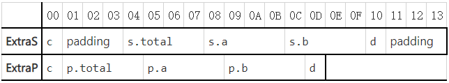
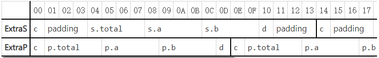
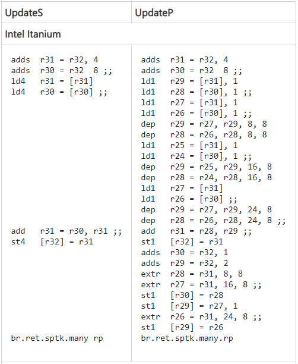

# 如非必要，别用#pragma pack(1)包装结构体
> Anybody who writes #pragma pack(1) may as well just wear a sign on their forehead that says “I hate RISC”
> https://devblogs.microsoft.com/oldnewthing/20200103-00/?p=103290
## 正文
当你使用#pragma pack(1)包装结构体时，它会告诉编译器把默认的结构体内存打包方式改为逐字节打包，意味着那些为了内存对齐而填充的字节会被移除掉。考虑如下两个结构体：
```
// no #pragma pack in effect.
struct S
{
    int32_t total;
    int32_t a, b;
};

#pragma pack(1)
struct P
{
    int32_t total;
    int32_t a, b;
};
```
虽然你会发现这两个结构体的内存布局是完全一样的（因为所有成员变量是天然对齐的，没有任何多余的填充），但是它们不是完全等价的！改变结构体内存打包方式的另一个影响是，它会修改结构体本身的内存对齐方式。在这个例子中，P可以被放在任意地址上，而S只能被放在4的倍数的地址上。
```
struct ExtraS
{
    char c;
    S s;
    char d;
}

struct ExtraP
{
    char c;
    P p;
    char d;
};
```
尽管S和P的内存布局是完全一样的，但是内存对齐方式的不同，导致了ExtraS和ExtraP的不同。

ExtraS以一个char开始，随后填充3个字节，然后是S和d，最后会额外填充3个字节保证整个结构体的内存对齐。最后填充的字节也确保了ExtraS数组有连续的、对齐的内存布局。

ExtraP同样以一个char开始，但这次就没有额外的3个填充字节，紧接着就是S和d，最后也没有额外的填充字节，也不需要确保ExtraP数组的内存对齐。



当你开始使用数组之后，这种影响会更显著：



可以看到，在ExtraS中，`s.total` `s.a` `s.b` 总是按四字节对齐的，而ExtraP就没有规律可循。更不幸的是，在生成汇编代码的时候，就需要处理ExtraP内存不对齐的情况。
```
void UpdateS(S* s)
{
    s->total = s->a + s->b;
}

void UpdateP(P* p)
{
    p->total = p->a + p->b;
}
```
尽管S和P的内存布局是完全一样的，但是为其生成的汇编代码是完全不同的，这就是内存对齐方式不同导致的。



对于一些RISC指令集的处理器，其造成的代码膨胀是相当显著的，不仅如此，这也会影响编译器inline的决策。

结论就是：如非必要，别用#pragma pack(1)包装结构体。它会使你的代码膨胀，并且阻碍你的优化工作。

一个更细思极恐的事实：如果你之前使用了#pragma pack(1)来包装结构体，那么你就很难再回头了。你之前允许了结构体在内存中随意地排布，现在你后悔了，你想让结构体严格地进行内存对齐，但这对于之前版本的客户端来说，将是一个破坏性的改变。

## 讨论
1. 可以使用`__declspec(align(4))`或者`alignas(void*)`来恢复ExtraP的内存对齐。
2. #pragma pack(1)用来做序列化的工作（比如表示磁盘上的结构体或网络传输的结构体）是合理的。